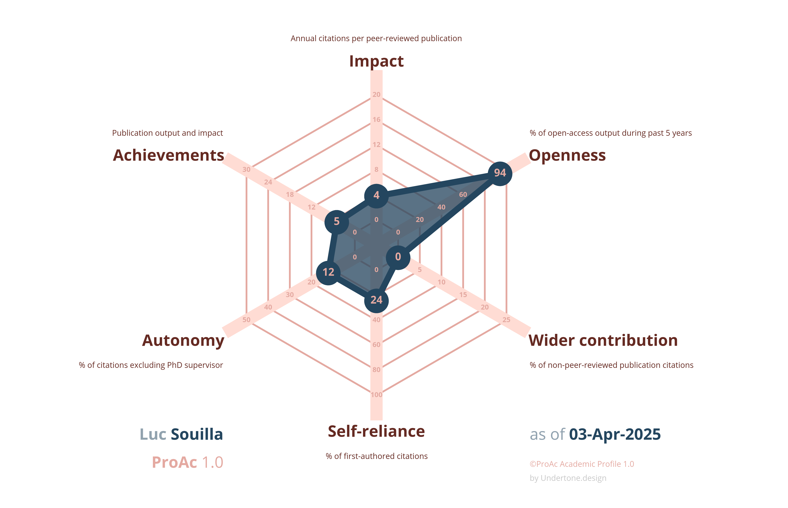

## Hi there, I am Luc! 👋

#### 🔬 About Me  
I am currently a **Postdoctoral Researcher** at the **Montreal Heart Institute** and the **University of Montréal**.  
My research explores the intersection of **health, physiology, and climate change** with a strong focus on vulnerable populations.  

#### 🎓 Research Background  
- 🏋️ **Ph.D. Focus**: Health-related physical fitness and physical activity, with the implementation of cardiac rehabilitation programs for children and adolescents with inherited cardiac diseases.  
- 🔥 **Postdoctoral Research**: Investigating **heat exposure** and its **physiological and perceptual** effects on individuals with health and economic vulnerabilities.  
- 🌱 **Future Interests**: Studying physiological responses in **vulnerable infants and children** facing environmental stressors.  

#### 🌍 Passion for Climate Change & Sustainability  
I am deeply interested in one of humanity’s greatest challenges 🌡️🌎  
- **Research & Academia in the Climate Crisis**  
   🔹 How academic practices may not align with climate action. 
    
- **My Personal Carbon Footprint**:  🌱 2024: 5.56 tCO₂e |  2023: 3.80 tCO₂e  

#### 🤝 Collaboration & Interests  
I’m looking to collaborate with anyone interested in:  Human thermoregulation / Cardiovascular responses / heat vulnerability / Sustainable research practices

  
#### 📢 Supporting Fairer Academic Evaluation  
Want to promote **fairer academic evaluation**? Check out **ProAc** by Fabio Crameri!  
Here’s mine:  

📄 **Want to know more?** Check out my **[CV](https://github.com/Souilla-Luc/CV/blob/master/CV.pdf)**  

